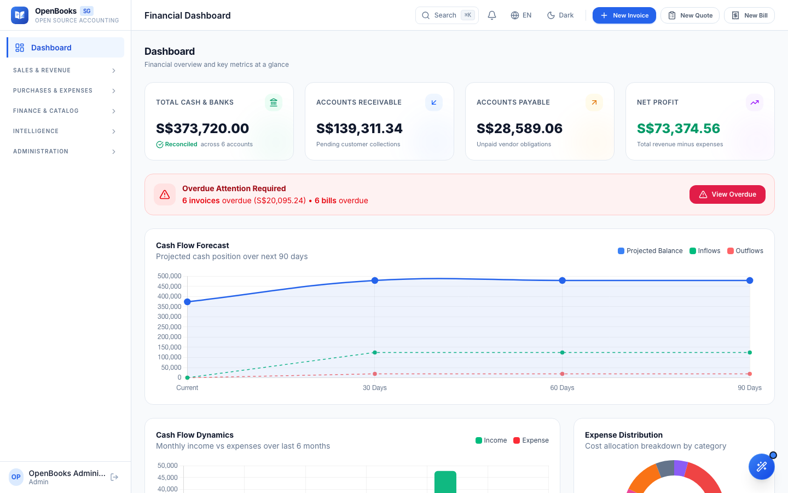
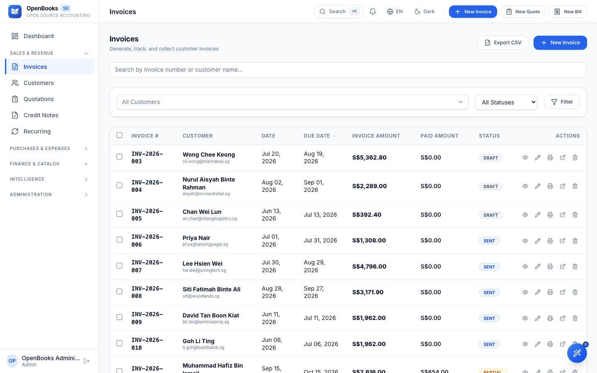
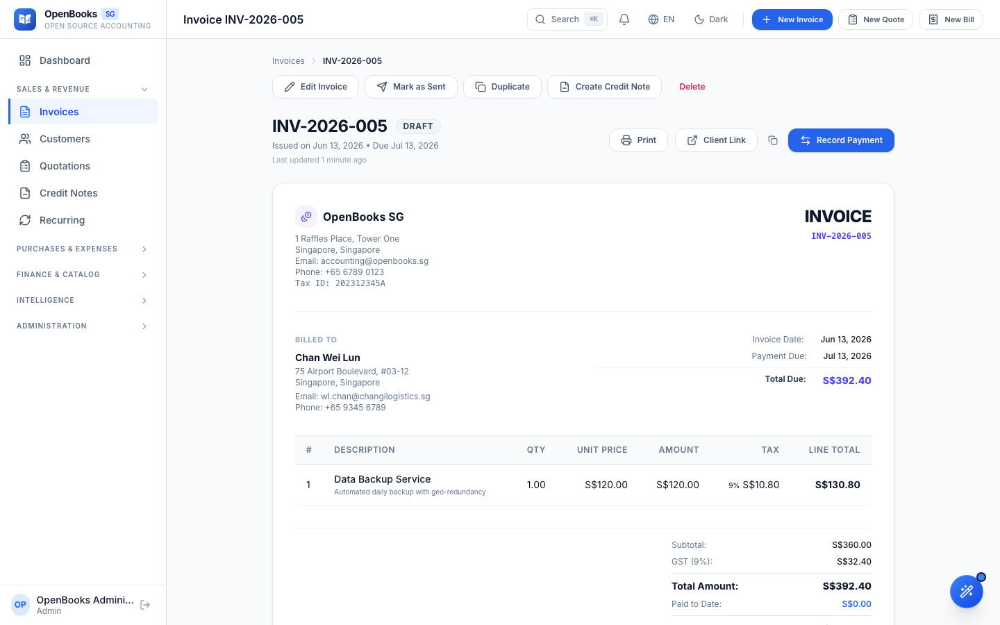
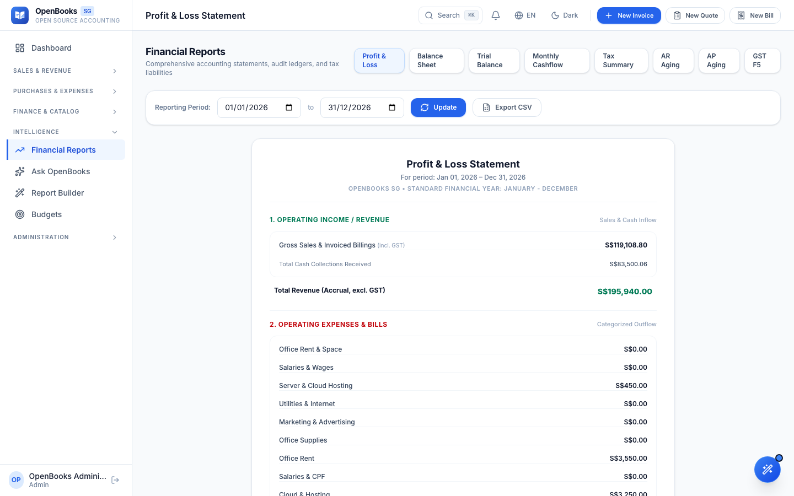
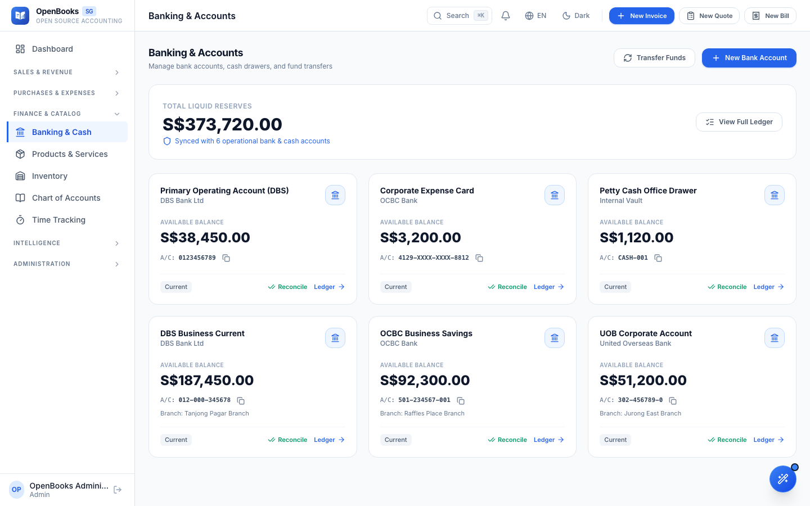
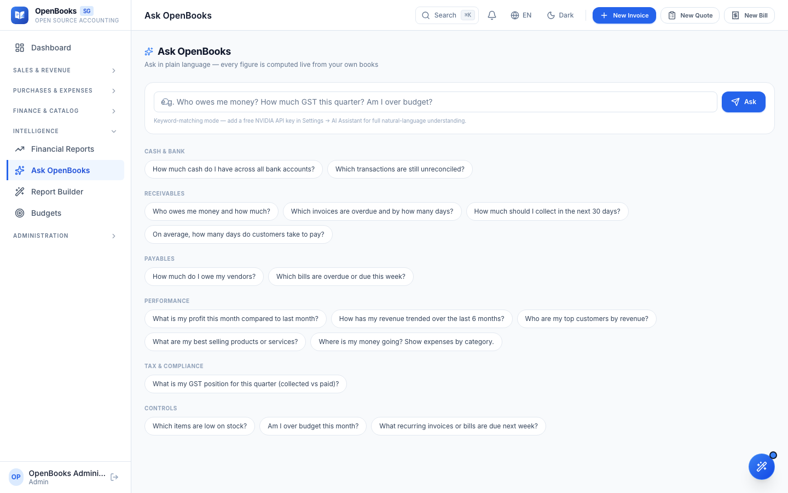

# OpenBooks SG

**Open-source accounting software built for Singapore**


[](https://github.com/consultanything-tech/openbooks-sg/actions/workflows/ci.yml)

---

OpenBooks SG is a full-featured, self-hosted accounting platform designed specifically for Singapore-based businesses. It handles everything from invoicing and bill management to GST F5 filing, PayNow QR payments, and multi-currency support -- all while keeping your financial data on your own infrastructure.

Built on Laravel 13 and PHP 8.3+, OpenBooks SG provides a modern web interface with a REST API for integrations, an AI assistant for natural-language queries, receipt OCR powered by NVIDIA NIM, and a customer self-service portal. Whether you are a solo freelancer or a growing SME, OpenBooks SG gives you enterprise-grade accounting without the enterprise price tag.

This project is open source under the MIT license. Contributions, issues, and feature requests are welcome.

## Features

### Core Accounting
- Invoices with payment recording, duplication, and email sending
- Bills with vendor payment tracking
- Quotations with accept/decline workflow and one-click convert to invoice
- Credit notes with apply-to-invoice support
- Chart of accounts with trial balance and journal entries
- Recurring invoice/bill templates with scheduling

### Singapore Features
- PayNow QR / SGQR payment integration
- GST F5 report for IRAS compliance
- UEN-based tax identification
- SGD as base currency with multi-currency support and exchange rate management

### Business Tools
- Inventory management with stock adjustments, low-stock alerts, and movement tracking
- Time tracking with convert-to-invoice workflow
- Expense claims with multi-step approval (submit, approve, reject, mark paid)
- Budget creation and tracking
- CSV import/export for customers, items, invoices, bills, and transactions

### Banking
- Multi-account bank management
- Inter-account transfers
- Bank reconciliation with unreconcile support
- OFX / QBO / CSV transaction import

### Reports
- Profit & Loss statement
- Balance Sheet
- Accounts Receivable aging
- Accounts Payable aging
- Income & Expense analysis
- GST F5 tax summary
- GST F5 export
- Custom report builder with save/export

### Customer Portal
- Self-service login for customers
- Invoice viewing and download
- Account statement generation

### AI & Automation
- AI assistant with natural-language chat interface
- Receipt OCR via NVIDIA NIM for automated expense entry
- Scheduled jobs for recurring document generation
- Automated email reminders for overdue invoices

### Developer
- REST API with 20 endpoints (v1)
- Keyboard shortcuts for power users
- Full activity log with audit trail
- Database backup and restore from the dashboard
- Web installer for first-time setup

### Security
- Role-based access control (ADMIN, ACCOUNTANT, VIEWER)
- Two-factor authentication (TOTP)
- Rate limiting on authentication and sensitive endpoints
- Session encryption support

## Screenshots

| | |
|:---:|:---:|
|  |  |
| **Financial dashboard** — cash position, receivables, payables, and cash-flow forecast at a glance | **Invoices** — list, filter, and track invoice status from draft to paid |
|  |  |
| **Invoice detail** — line items, GST breakdown, and payment state | **Profit & Loss** — accrual-basis statement with reporting-period controls |
|  |  |
| **Banking** — multi-account balances and transaction history | **Ask OpenBooks** — plain-language questions answered live from your books |

## Quick Start

### Requirements

- PHP 8.3+ with extensions: `pdo_mysql`, `gd`, `zip`, `bcmath`, `intl`, `mbstring`
- MySQL 8.0+
- Composer 2.x
- Node.js 20+ and npm

### Installation

```bash
# Clone the repository
git clone https://github.com/consultanything-tech/openbooks-sg.git
cd openbooks-sg

# Install PHP dependencies
composer install

# Set up environment
cp .env.example .env
php artisan key:generate

# Configure your database in .env
# DB_HOST=127.0.0.1
# DB_PORT=3306
# DB_DATABASE=openbooks_sg
# DB_USERNAME=root
# DB_PASSWORD=secret

# Run migrations
php artisan migrate

# Install frontend dependencies and build assets
npm install
npm run build

# Start the development server
php artisan serve
```

Visit `http://localhost:8000/install` to run the web installer and create your admin account.

### Docker Alternative

```bash
# Clone and start all services
git clone https://github.com/consultanything-tech/openbooks-sg.git
cd openbooks-sg
docker compose up -d
```

Services will be available at:

| Service     | URL                    |
|-------------|------------------------|
| Application | http://localhost:8080   |
| phpMyAdmin  | http://localhost:8081   |
| MySQL       | localhost:3307          |

## Tech Stack

| Layer      | Technology              |
|------------|-------------------------|
| Language   | PHP 8.3+                |
| Framework  | Laravel 13              |
| Database   | MySQL 8.0               |
| Frontend   | Blade Templates, Tailwind CSS |
| Testing    | PHPUnit 12              |
| Code Style | Laravel Pint            |
| Container  | Docker (PHP-FPM + Nginx 1.27 Alpine) |
| AI / OCR   | NVIDIA NIM              |

## API Reference

All endpoints are prefixed with `/api/v1` and require Bearer token authentication.

| Method   | Endpoint                    | Description                    |
|----------|-----------------------------|--------------------------------|
| `GET`    | `/invoices`                 | List all invoices              |
| `GET`    | `/invoices/{id}`            | Get a single invoice           |
| `POST`   | `/invoices`                 | Create an invoice              |
| `PUT`    | `/invoices/{id}`            | Update an invoice              |
| `DELETE` | `/invoices/{id}`            | Delete an invoice              |
| `GET`    | `/customers`                | List all customers             |
| `GET`    | `/customers/{id}`           | Get a single customer          |
| `POST`   | `/customers`                | Create a customer              |
| `PUT`    | `/customers/{id}`           | Update a customer              |
| `GET`    | `/quotes`                   | List all quotes                |
| `GET`    | `/quotes/{id}`              | Get a single quote             |
| `POST`   | `/quotes`                   | Create a quote                 |
| `GET`    | `/payments`                 | List all payments              |
| `POST`   | `/payments`                 | Record a payment               |
| `GET`    | `/bills`                    | List all bills                 |
| `GET`    | `/bills/{id}`               | Get a single bill              |
| `GET`    | `/items`                    | List all items                 |
| `GET`    | `/reports/profit-loss`      | Profit & Loss report           |
| `GET`    | `/reports/balance-sheet`    | Balance Sheet report           |
| `GET`    | `/company`                  | Get company profile            |

Full documentation with request/response examples is available in [docs/API.md](docs/API.md).

## Keyboard Shortcuts

Press `?` anywhere in the app to view the shortcuts overlay.

### Navigation

| Shortcut | Action           |
|----------|------------------|
| `G` `D`  | Go to Dashboard  |
| `G` `I`  | Go to Invoices   |
| `G` `B`  | Go to Bills      |
| `G` `C`  | Go to Customers  |
| `G` `Q`  | Go to Quotes     |
| `G` `R`  | Go to Reports    |

### Actions

| Shortcut | Action            |
|----------|-------------------|
| `N` `I`  | New Invoice       |
| `N` `B`  | New Bill          |
| `N` `Q`  | New Quote         |
| `T` `T`  | Toggle Dark Mode  |

### Global

| Shortcut | Action             |
|----------|--------------------|
| `?`      | Show Shortcuts     |
| `Esc`    | Close / Escape     |

## Default Roles

| Role       | View Data | Create/Edit | Delete | Settings | User Mgmt | Backups | Updates |
|------------|:---------:|:-----------:|:------:|:--------:|:---------:|:-------:|:-------:|
| **ADMIN**      | Yes | Yes | Yes | Yes | Yes | Yes | Yes |
| **ACCOUNTANT** | Yes | Yes | Yes | No  | No  | No  | No  |
| **VIEWER**     | Yes | No  | No  | No  | No  | No  | No  |

## Testing

Tests run against an SQLite in-memory database by default.

```bash
# Run all tests
php artisan test

# Or via Composer
composer test

# Run a specific test file
php artisan test tests/Feature/InvoiceTest.php
```

## Contributing

We welcome contributions from the community. Please read [CONTRIBUTING.md](CONTRIBUTING.md) for details on our development process, code style, and how to submit pull requests.

## License

OpenBooks SG is open-source software licensed under the [MIT License](LICENSE).
